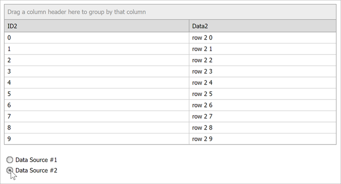

<!-- default badges list -->

<!-- default badges end -->

# Grid View for ASP.NET Web Forms - How to dynamically switch the Grid's data source and recreate columns at runtime

This example demonstrates how to use the same grid to display different data sources ([SqlDataSource](https://docs.microsoft.com/en-us/dotnet/api/system.web.ui.webcontrols.sqldatasource?view=netframework-4.8) instances). 

[Grid columns](https://docs.devexpress.com/AspNet/3691/components/grid-view/concepts/data-representation-basics/columns) are recreated when a new data source is assigned. Note that the data source is unconditionally assigned on each postback/callback in the [ASPxGridView.Load](https://docs.microsoft.com/en-us/dotnet/api/system.web.ui.control.load?view=netframework-4.8) event handler, while columns are recreated only after the data source is switched.

## Files to Look At

* [Default.aspx](./CS/WebSite/Default.aspx) (VB: [Default.aspx](./VB/WebSite/Default.aspx))
* [Default.aspx.cs](./CS/WebSite/Default.aspx.cs) (VB: [Default.aspx.vb](./VB/WebSite/Default.aspx.vb))

## Documentation

* [Callbacks](https://docs.devexpress.com/AspNet/402559/common-concepts/callbacks)
* [ASPxGridView](https://docs.devexpress.com/AspNet/DevExpress.Web.ASPxGridView)
* [Grid View - Bind to Data](https://docs.devexpress.com/AspNet/3719/components/grid-view/concepts/bind-to-data)
* [Grid View - Data Columns](https://docs.devexpress.com/AspNet/114141/components/card-view/concepts/data-representation-basics/columns/data-columns?p=netframework)
* [ASPxRadioButtonList](https://docs.devexpress.com/AspNet/DevExpress.Web.ASPxRadioButtonList?p=netframework)

## More Examples

* [How to bind ASPxGridView created at design mode to different data sources at runtime](https://github.com/DevExpress-Examples/how-to-bind-aspxgridview-created-at-design-mode-to-different-data-sources-at-runtime-e2965)  
The grid is created in design mode.
* [How to bind ASPxGridView with manually created columns to different data sources](https://github.com/DevExpress-Examples/how-to-bind-aspxgridview-with-manually-created-columns-to-different-data-sources-e2967)  
The grid is created in design mode.
* [How to bind ASPxGridView created at runtime to different data sources](https://github.com/DevExpress-Examples/how-to-bind-aspxgridview-created-at-runtime-to-different-data-sources-e2968)  
The grid is created at runtime.
<!-- feedback -->
## Does this example address your development requirements/objectives?

 

(you will be redirected to DevExpress.com to submit your response)
<!-- feedback end -->
